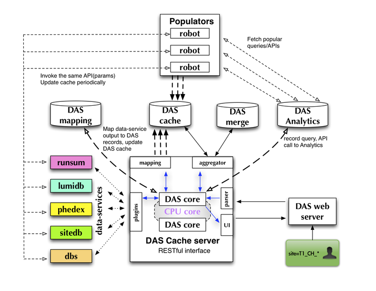

DAS architecture
================

DAS architecture is based on several components:
   - common core library

     - analytics DB
     - mapping DB
     - caching DB
     - merging DB
     - logging DB
   - data-service plugins, each plugin contains

     - data-service handler class
     - API map
     - notation map
   - cache server
   - client web server

The last two components, cache and client servers, are optional.
The code itself can work without cache/client servers with the 
CLI tool which uses core libraries. But their existence allows 
the introduction of DAS pre-fetch strategies, DAS robots, which 
can significantly improve responsiveness of the system and add
multi-user support into DAS. The following picture represents 
current DAS architecture:

It consists of DAS web server with RESTful interface, DAS
cache server, DAS Analytics/Mapping/Cache DBs and DAS robots 
(for pre-fetching queries). The DAS cache server uses multithreading
to consume and work on several user requests at the same time. 
All queries are written to the DAS Analytics DB. A mapping between 
data-service and DAS notations is stored in the DAS Mapping DB. 
Communication with end-users is done via set of REST calls. 
User can make GET/POST/DELETE requests to fetch or delete 
data in DAS, respectively. The DAS workflow can be summarised as:

- DAS cache-server receives a query from the client (either DAS web server or DAS CLI)
- The input query is parsed and the selection key(s) and condition(s) 
  identified and mapped to the appropriate data-services
- The query is added to the DAS Analytics DB
- The DAS cache is checked for existing data

  - if available

    - Data is retrieved from the cache

  - otherwise:

    - The necessary data services are queried
    - The results are parsed, transformed and inserted into the DAS cache
    - The user receives a message that the data is being located
    
- The data is formatted and returned to the user

  

For more information please see the 
:ref:`DAS workflow <das_workflow>` page. 
The DAS DBs use the MongoDB document-oriented database (see [Mongodb]_),
although during design/evaluation process we considered 
a number of other technologies, such as different RDMS flavors, memcached [Memcached]_ and
other key-value based data stores (eg CouchDB [Couchdb]_), etc.
