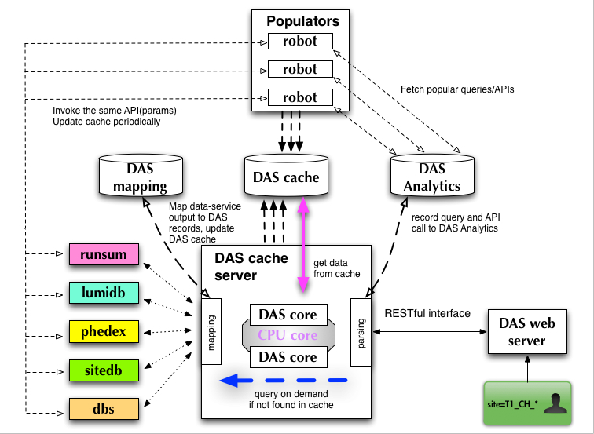

DAS architecture
================

DAS architecture is based on several components:
   - common core library

     - analytics DB
     - mapping DB
     - logging DB
   - data-service plugins, each plugin contains

     - data-service handler class
     - API map
     - notation map
   - cache server
   - client web server

Last two components, cache and client servers, are optional.
The code itself can work without cache/client servers by using
CLI tool which uses core librarys. But their existence allow 
to introduce DAS pre-fetch strategies, DAS robots, which can
significantly improve responsiveness of the system and add
multi-user support into DAS. The following 
picture represents current DAS architecture:

It consists of DAS web server with RESTful interface, DAS cache server, 
DAS Analytics/Mapping/Cache DBs and optional DAS robots 
(for queries pre-fetching). The DAS cache server utilizes threading 
technologies to consume and work on several requests at the same time. 
All queries are written to DAS Analytics DB. A mapping between 
data-service notations and DAS is stored in DAS Mapping DB. 
Communication with end-users is done via set of REST calls. 
User can pose GET/POST/DELETE requests to get/request or delete 
data in DAS, respectively. Below we outline all steps in DAS workflow:

- DAS cache-server receives query from the client (either DAS web server or DAS CLI)
- It parses input query and extract information about selection key(s) 
  and condition(s) and maps them to corresponding data-services
- It records query into DAS Analytics DB
- It checks DAS cache for existing data

  - if not available:

    - it submits request to necessary data-services
    - It transform data-service output into DAS records and store them into DAS cache
    - it return DAS document with message that data is requested

  - if data is available in DAS cache

    - It retrieves data from DAS cache and return them to the client

For more information please use 
:ref:`DAS workflow <das_workflow>` page. 
The DAS DBs are based on document-oriented database, see
`MongoDB <http://www.mongodb.org>`_, 
even though during design/evaluation process we considered 
usage of other technologies, such as different flavor of RDMS, 
`memcache <http://memcached.org/>`_, 
key-value based data stores,
`CouchDB <http://couchdb.apache.org/>`_, etc.
