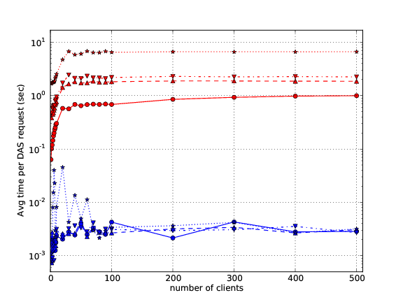
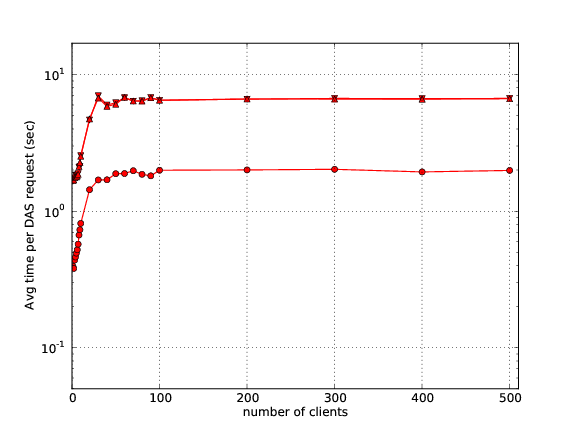
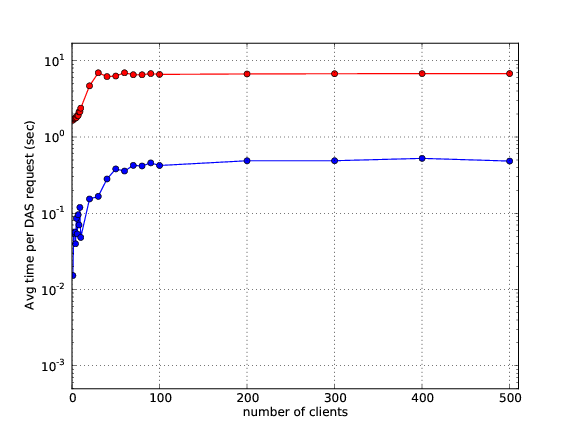

DAS benchmarks
==============

DAS profiling
-------------

DAS has been profiled on vocms67:

- 8 core, Intel Xeon CPU @ 2.33GHz, cache size 6144 KB
- 16 GB of RAM
- Kernel 2.6.18-164.11.1.el5 #1 SMP Wed Jan 20 12:36:24 CET 2010 x86_64 x86_64 x86_64 GNU/Linux

The DAS benchmarking is performed using the following query

.. doctest::

   das_cli --query="block" --no-output

Latest results are shown below:

.. doctest::

    ...
    INFO   0x9e91ea8> DASMongocache::update_cache, ['dbs'] yield 387137 rows
    ...
    INFO   0x9e91ea8> DASMongocache::update_cache, ['phedex'] yield 189901 rows
    ...
    INFO   0x9e91ea8> DASMongocache::merge_records, merging 577038 records

    DAS execution time (phedex) 106.446726799 sec
    DAS execution time (dbs) 72.2084658146 sec
    DAS execution time (merge) 62.8879590034 sec
    DAS execution time 241.767010927 sec, Wed, 20 Jan 2010 15:54:33 GMT

The largest contributors to execution time are

.. doctest::

    das_cli --query="block" --verbose=1 --profile --no-output

    Mon Jan 18 22:43:27 2010    profile.dat

         54420138 function calls (54256630 primitive calls) in 247.423 CPU seconds

   Ordered by: internal time

   ncalls  tottime  percall  cumtime  percall filename:lineno(function)
   560649   78.018    0.000   78.018    0.000 {method 'recv' of '_socket.socket' objects}
      992   23.301    0.023   23.301    0.023 {pymongo._cbson._insert_message}
  1627587   19.484    0.000   19.484    0.000 {DAS.extensions.das_speed_utils._dict_handler}
      467   17.295    0.037   21.042    0.045 {pymongo._cbson._to_dicts}
    23773   16.945    0.001   16.945    0.001 {built-in method feed}
   576626   12.101    0.000   77.974    0.000 /data/projects/das/COMP/DAS/src/python/DAS/utils/utils.py:709(xml_parser)
  1627587    9.383    0.000   28.867    0.000 /data/projects/das/COMP/DAS/src/python/DAS/utils/utils.py:694(dict_helper)
   969267    7.716    0.000   10.656    0.000 /data/projects/das/slc5_amd64_gcc434/external/py2-pymongo/1.3/lib/python2.6/site-packages/pymongo/objectid.py:77(__generate)
   392636    4.499    0.000   47.851    0.000 /data/projects/das/COMP/DAS/src/python/DAS/utils/utils.py:798(aggregator)
        1    3.877    3.877   72.942   72.942 /data/projects/das/COMP/DAS/src/python/DAS/core/das_mongocache.py:522(merge_records)
  1153242    3.644    0.000    5.443    0.000 /data/projects/das/COMP/DAS/src/python/DAS/utils/utils.py:52(dict_value)
   576626    3.042    0.000   89.345    0.000 /data/projects/das/COMP/DAS/src/python/DAS/core/das_mongocache.py:586(update_records)
   576715    3.002    0.000    8.917    0.000 /data/projects/das/slc5_amd64_gcc434/external/py2-pymongo/1.3/lib/python2.6/site-packages/pymongo/database.py:183(_fix_outgoing)
   969267    2.798    0.000   17.809    0.000 /data/projects/das/slc5_amd64_gcc434/external/py2-pymongo/1.3/lib/python2.6/site-packages/pymongo/database.py:170(_fix_incoming)
   ......

Benchmarks tool
---------------

The DAS provides a benchmarking tool, das_bench

.. doctest::

    das_bench --help

    Usage: das_bench [options]

    Examples:
      Benchmark Keyword Search:
      das_bench --url=https://cmsweb-testbed.cern.ch/das/kws_async --nclients=20 --dasquery="/DoubleMu/A/RAW-RECO magnetic field and run number" --output=results.png

      Benchmark DAS Homepage (repeating each request 10 times):
      src/python/DAS/tools/das_bench.py --url=https://das-test-dbs2.cern.ch/das --nclients=30 --dasquery="whatever" --accept=text/html --logname=DAS --output=DAS_home_no_kws_.png --repeat=10

    Options:
      -h, --help            show this help message and exit
      -v DEBUG, --verbose=DEBUG
                            verbose output
      --url=URL             specify URL to test, e.g.
                            http://localhost:8211/rest/test
      --accept=ACCEPT       specify URL Accept header, default application/json
      --idx-bound=IDX       specify index bound, by default it is 0
      --logname=LOGNAME     specify log name prefix where results of N client
                            test will be stored
      --nclients=NCLIENTS   specify max number of clients
      --minclients=NCLIENTS specify min number of clients, default 1
      --repeat=REPEAT       repeat each benchmark multiple times
      --dasquery=DASQUERY   specify DAS query to test, e.g. dataset
      --output=FILENAME     specify name of output file for matplotlib output,
                            default is results.pdf, can also be file.png etc

which can be used to benchmark DAS.

Benchmark CMS data
------------------

We used ~50K datasets from CMS DBS system and ~450K block records 
from both DBS and Phedex CMS systems. All of them were populated 
into DAS cache up-front, since I was only interested in read tests 
(DAS have an ability to populate the cache).
The tests consist of three different types of queries:

- all clients use fixed value for DAS queries, e.g. dataset=/a/b/c or block=/a/b/c#123
- all clients use fixed pattern for DAS queries, e.g. dataset=/a* or block=/a*
- all clients use random patterns, e.g. dataset=/a*, dataset=/Z* or block=/a*, block=/Z*

Once the query has been placed into DAS cache server we retrieve 
only first record out of the result set and ship it back to the client. 
The respond time is measured as the total time DAS server spends for 
a particular query.

Benchmark results
-----------------

First, we tested our CherryPy server and verified that it can sustain a 
load of 500 parallel clients at the level of 10^-5 sec. Then we populated 
MongoDB with 50k dataset and 500k block records from DBS and Phedex 
CMS systems. We performed the read test of MongoDB and DAS using 
1-500 parallel clients with current set of CMS datasets and block
meta-data, 50K and 450K, respectively. Then we populated MongoDB 
with 10x and 100x of statistics and repeat the tests. 
The plot showing below represents comparison of DAS (red lines) 
versus MongoDB (blue lines) read tests for 50k (circles), 
500k (down triangles), 5M (up triangles) and 50M (stars):

We found these results very satisfactory. As was expected 
MongoDB can easily sustain such load at the level of few mili-seconds. 
The DAS numbers also seems reasonable since DAS workflow is much 
more complicated. It includes DAS parsing, query analysis, analytics, etc.
The most important, the DAS performance seems to be driven by 
MongoDB back-end and has constant scale factor which can be tuned later.

Next we performed three tests discussed above with 10x of block meta-data
statistics.

The curve with circles points represents test #1, i.e. fixed key-value, 
while top/down triangles represents pattern value and random pattern 
value, tests #2 and #3, respectively. As can be seen pattern tests 
are differ by the order of magnitude from fixed key-value, 
but almost identical among each other.

Finally, we tested DAS/MongoDB with random queries and random data access, 
by asking to return me a single record from entire collection (not only 
the first one as shown above). For that purpose we generated a random 
index and used idx/limit for MongoDB queries. Here is the results

The blue line shows MongoDB performance, while red shows the DAS. 
This time the difference between DAS and MongoDB is only one order of 
magnitude differ with respect to first shown plot and driven by DAS workflow.
