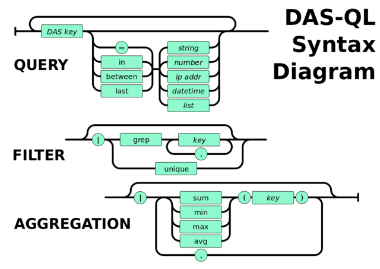

DAS Query Language
==================

DAS Query Language (DAS-QL) provides intuitive, easy to use text based queries
to underlying data-services. 
Its syntax is represneted in the following diagram

We can represent it via set of pipes, similar to UNIX pipes, the key look-up
fields followed by filter and/or aggregator:

.. doctest::

   <key> <key> = <value> ... | <filter> <key.att> <op> <value>, ... | <aggregator>, ...
   <key> date last <value h|m>
   <key> date between [YYYYMMDD, YYYYMMDD]

Here the *<key>* is a valid DAS key, e.g. *dataset, run* and *<op>* is a valid DAS
operator, e.g. <, >, <=, >=. The *<key.att>* represents a key attribute.
They are deduced form the DAS records. For instance, if file record
contain *size, id, md5 fields*, all of them can be used as attributed of
the *file* key, e.g. *file.md5*. But the attributes cannot appear in look-up
part of the query.

The DAS query can be supplemented either by filters or aggregator functions.
The filter consists of filter name and *key/key.attributes* value pair or
*key/key.attributes* fields. The support filters are: *grep, unique, sort*.
To *unique* filter does not require a *key*.

The supported aggregator functions are:
*sum, count, min, max, avg, median*. A wild-card patterns are supported 
via asterisk character. 

Here is just a few valid examples how to construct DAS query using
file and dataset keys and file.size, dataset.name key attributes:

.. doctest::

    file dataset=/a/b/c | unique
    file dataset=/a/b/c | grep file.name, file.size
    file dataset=/a/b/c | sort file.name
    file dataset=/a/b/c | grep file.name, file.size, | sort file.size
    file dataset=/a/b/c | sum(file.size)
    file dataset=/a/b/c | grep file.size>1 | sum(file.size)
    file dataset=/a/b*

Special keywords
----------------
DAS has a several special keywords: *system, date, instance, records*.

- The *system* keyword is used to retrieve a records only from specified
  system (data-service), e.g. DBS.
- The *date* can be used in different queries and accepts values in
  YYYYMMDD format as well as can be specified as *last* value, e.g.
  *date last 24h, date last 60m*, where h, m are
  hours, minutes, respectively.
- The *records* keyword can be used to retrieve DAS records regardless
  from their content. For instance, if one user place a query
  *site=T1_CH_CERN\**, the DAS requests data from several data-services
  (Phedex, SiteDB), while the output results will only show site
  related records. If user wants to see which other records exists
  in DAS cache for given parameter, he/she can use
  *records site=T1_CH_CERN\** to do that. In that case user will get back
  all records (site, block records) associated with given condition.

