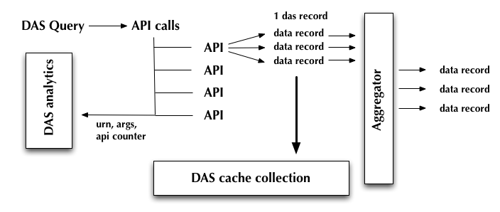

DAS records
***********

.. toctree::
   :maxdepth: 2

   data_objects.rst

DAS records represent meta-data in [JSON]_ data format. This is a lightweight, near
universal format which can represent complex, nested structures via values, dictionaries, 
lists. JSON is a native JavaScript data format (JavaScript Object Notation), and
is represented by the dictionary type in python.
A DAS record is just a collection of data supplied by data-services which
participate in DAS. DAS wraps each data-service record with auxiliary meta-data such as
internal ID, references to other DAS records, and a DAS header. The DAS header
contains information about underlying API calls made to data-provider. For example:

.. doctest::

    {"query": "{\"fields\": null, \"spec\": {\"block.name\": \"/abc\"}}", 
     "_id": "4b6c8919e2194e1669000002", 
     "qhash": "aa8bcf183d916ea3befbdfbcbf40940a",
     "das": {"status": "ok", "qhash": "aa8bcf183d916ea3befbdfbcbf40940a", 
             "ctime": [0.55365610122680664, 0.54806804656982422], 
             "url": ["http://a.v.com/api", "http://c.d.com/api"], 
             "timestamp": 1265404185.2611251, 
             "lookup_keys": ["block.name", "file.name", "block.name"], 
             "system": ["combined"], 
             "services": [{"combined":["dbs", "phedex"]}],
             "record": 0,
             "api": ["blockReplicas", "listBlocks"], 
             "expire": 1265407785.2611251}
    }

DAS workflow produce the following set of records

- data records, which contains data coming out from data-services, every data
  record contains a pointer to das record
- das records, which contains information how we retrieve data
- analytics records, which contains information about API calls
