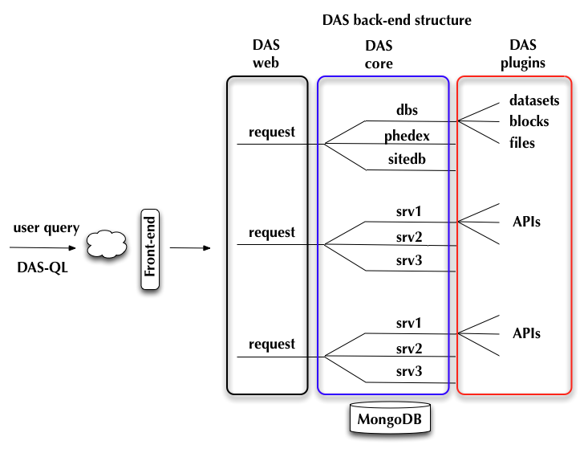

DAS server
==========
DAS server is multi-threaded application which runs within CherryPy web
framework. It consists of the following main componens:

- DAS web server
- DAS core engine, which by itself consist of

  - DAS abstract data-service
  - Data-provider plugins (data-service implementations)

- DAS analytics daemons
- DAS command-line client
- Data-provider daemons, e.g. DBS daemon, etc.
- Various monitors, e.g. MongoDB connection monitor, etc.
- MongoDB

Upon user request, the front-end validates user input and pass it to DAS web
server. It decompose user query into series of requests to underlying core
engine, who by itself invokes multiple APIs to fetch data from data-provider
and place them into MongoDB. Later this data are serverd back to the user and
stay in cache for period of time determined by data-providers, see Figure:

Below we outline a typical layout of DAS server threads:

- 1 main thread
- 1 dummy
- 1 TimeoutMonitor thread
- 1 HTTP server thread
- 1 dbs_phedex_monitor thread
- 1 lumi_service thread
- n_cp-CherryPy threads 
- n_das worker threads, they are divided as following:

  - n_web allocated for web workers
  - n_core allocated for DAS core workers
  - n_api allocated for DAS service APIs

Therefore the total number of threads is quite hight (range in first hundred)
and it is determined by the following formula

.. doctest::

    tot_threads = n_main + n_cp + n_das
    n_main = (main + timeout + http + dbs_phedex + lumi) threads
    n_cp is defined in DAS configuration file, typical value is 30
    n_das = n_web + n_core + n_api
    n_web is defined in DAS config file, see web_server.web_workers
    n_core is defined in DAS config file, see das.core_workers
    n_api is defined in DAS config file, see das.api_workers
