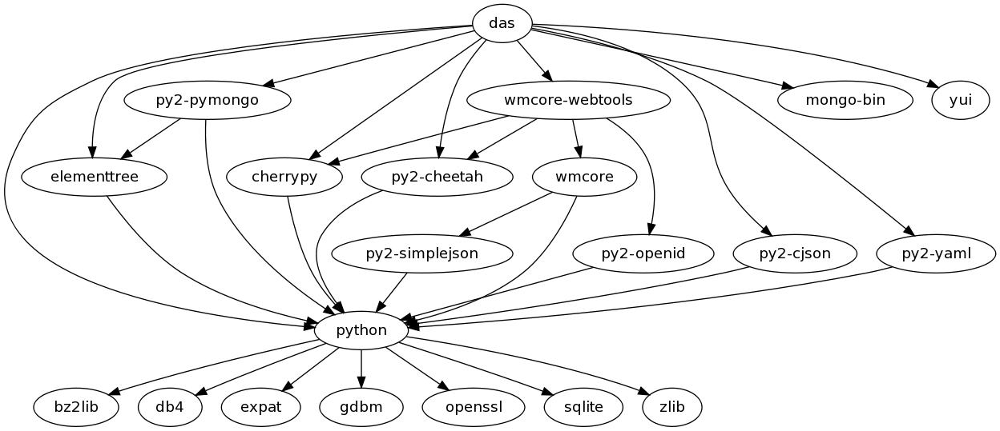

Introduction
============

DAS stands for Data Aggregation Service. It is general purpose
framework to unify CMS data-services into a common layer used 
by CMS physicists and production tools. It provides several
features:

  1. a caching layer for CMS data-services
  2. a common tool to look-up CMS meta-data 
  3. an aggregation layer for CMS meta-data

The main advantage of DAS is uniform meta-data representation
and ability to look-up it via free text-based queries.
The DAS data-format is JSON. All meta-data queried and stored
into DAS are converted into this format according to provided
mapping and common set of notations for CMS data-services
participating in DAS.

Dependencies
------------
DAS is written in python and relies on standard python modules.
The underlying back-end is `MongoDB <http://www.mongodb.org>`_,
which provides *schema-less* storage and generic query language.
Below you can see current set of dependencies for DAS:

