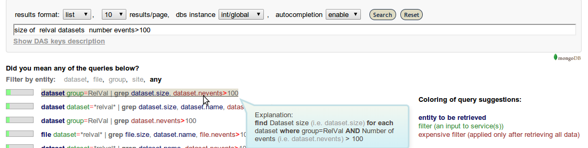
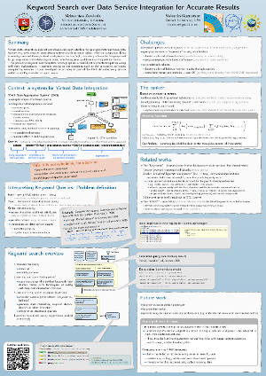

Query suggestions based on Keyword Search
=========================================

Virtual Data Integration (such as this system, DAS) provides a
coherent interface for querying heterogeneous data sources
(e.g., web services, proprietary systems) with minimum upfront effort.
Still, this requires its users to learn a new query
language and to get acquainted with data organization which may pose problems
even to proficient users.

The keyword search plugin, proposes a ranked list of structured
queries along with their explanations.

Below is an example of keyword search suggestions for an unstructured query:

The results can be even more accurate if the query is at least partially
structured.

.. rubric:: Implementation details

.. figure:: _images/kws_architecture.png
     :align: right

     The major components and steps in generating the suggestions

The keyword search operates in "offline" mode - matching the keywords to
the available metadata, such as the constraints on inputs accepted by services,
or the list of values for some fields.

The code is still rather messy and needs some cleanup and generalization,
however it provides a working open source implementation
of the keyword search based query suggestions for data service integration
(and it could quite easily be generalized for some other domain than the one of
the CMS Experiment).

For more details on the implementation see
the :ref:`code documentation<kws-code-docs>` and the code itself.

More information and lessons learned may be found on in the
following publications and whitepapers:

**DAS KWS Poster**

**DAS KWS Paper**

https://github.com/vidma/das-paper/blob/master/paper.pdf

.. container:: clearer

    .. image:: _images/spacer.png

