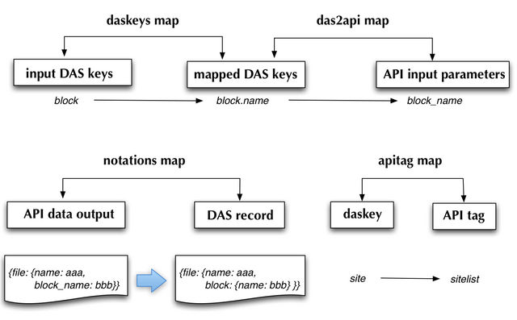

.. _das_mapping:

DAS Mapping DB
==============
DAS Mapping DB holds information about all data-service APIs 
which participate in DAS. It provides maps to convert from/to 
DAS to/from API notations:

Two maps, daskeys and das2api serve transformation from input
DAS keys used by end-user into DAS record key and API input parameter.
The notation maps is used to adjust keys for API records. Basically
it provides a way to transform API raw output into DAS records.
Optional apitag map is used to instruct DAS which API tag to use for given
DAS key.

Below we provide a particular examples of CMS mapping records in DAS Mapping DB:

- API metric example:

.. _api_map:
.. doctest::

    {"api": {"params": {"node": "*", "se": "*", "block": "*"}, "name": "blockReplicas"}, 
     "das2api": [
         {"pattern": "re.compile('^T[0-3]_')", "api_param": "se", "das_key": "site"}, 
         {"pattern": "re.compile('([a-zA-Z0-9]+\\.){2}')", "api_param": "node", "das_key": "site"},        
         {"pattern": "", "api_param": "block", "das_key": "block"}
     ], 
     "_id": "4aafbfa5e2194e22e3000009", 
     "system": "phedex", 
     "daskeys": [{"pattern": "", "key": "block", "map": "block.name"}]
    }

- API notations example:

.. _notation:
.. doctest::

    {"notations": [
         {"das_name": "creation_time", "api_param": "time_create"}, 
         {"das_name": "modification_time", "api_param": "time_update"}, 
         {"das_name": "size", "api_param": "bytes"}, 
         {"das_name": "site", "api_param": "node"}, 
         {"das_name": "nfiles", "api_param": "files"}, 
         {"das_name": "nevents", "api_param": "events"}, 
         {"das_name": "name", "api_param": "lfn"}, 
         {"das_name": "site", "api_param": "node"}
     ], 
     "_id": "4aafbfa5e2194e22e300000d", 
     "system": "phedex"
    }

Please note, each data-service must provide its mapping records in 
`YAML <http://en.wikipedia.org/wiki/Yaml>`_ data-format. The records shown
above are the ones stored into DAS storage back-end, while concrete mapping
can use any YAML representation, e.g. ascii.
