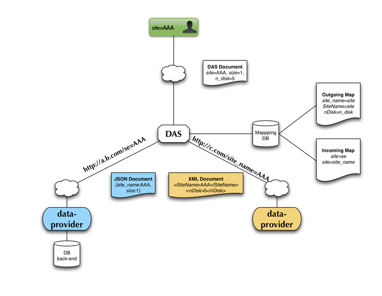
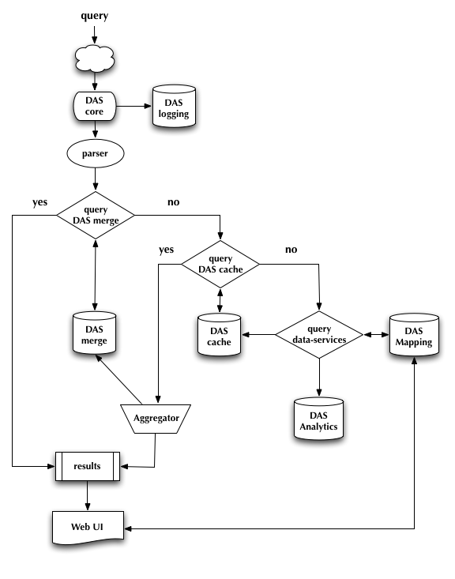

.. _das_requestflow:

DAS request flow
================
This diagram illustrates the request flow triggered by a user query.

The user makes the query *site=AAA*. 
DAS resolves it into several requests, by looking at the *daskeys* map
for each available data service, which indicates that two services
understand an input key *site*, which is transformed into queries
for each of those services with parameter *se* and *site_name*.

DAS then makes the API calls (assuming the data isn't already available).

- *http://a.b.com/se=AAA*
- *http://c.com/site_name=AAA*

and retrieves the results, which are re-mapped into DAS records
according to the *notation* map for each of those services.

.. _das_workflow:

DAS workflow
============
DAS workflow consists of the following steps:

- parse input query

  - look-up for a superset of query conditions in DAS merge cache
    (ie, have we recently handled a query guaranteed to have returned
    the data being requested now)

    - if unavailable

      - query raw cache

        - query services, to get the records that aren't available 
        - write new records to raw cache

      - perform aggregation

        - write aggregation results to merged cache

    - get results from merged cache
- present DAS records in Web UI (converting records if necessary)

